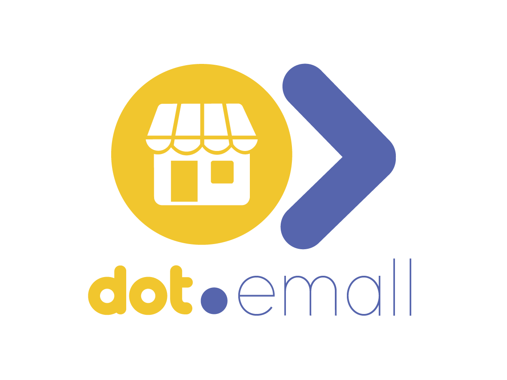

<div align="center">



<h1>Dot.Emall</h1>

<p>Multi-vendor online marketplace — open a store, list products, manage orders, and grow your business online.</p>

[](https://php.net)
[](https://laravel.com)
[](https://livewire.laravel.com)
[](https://postgresql.org)
[](tests/)
[](LICENSE)

</div>

---

## Overview

Dot.Emall is the multi-vendor marketplace platform in the Dot ecosystem. Vendors open stores, list products with images and variants, and manage orders — while shoppers browse, add to cart, checkout, and leave reviews — all within a single platform.

---

## Features

- **Multi-vendor stores** — each vendor gets a branded storefront with their product catalogue
- **Product catalogue** — images, variants, stock management, and self-referencing categories
- **Shopping cart** — persistent cart with quantity management and saved items
- **Order management** — status tracking (pending → processing → shipped → delivered)
- **Reviews** — star ratings and written reviews with average rating computed per product
- **Store categories** — nested category tree (self-referencing `parent_id`)
- **Ecosystem SSO** — authenticate from InfoDot with a single click

---

## Domain Model

```
StoreCategory (self-ref parent_id)
Store         → Products → ProductImages
                        → Reviews
              → Orders  → OrderItems → Product
User          → CartItems → Product
```

---

## Tech Stack

| Layer | Technology |
|---|---|
| Framework | Laravel 12 + PHP 8.4 |
| Frontend | Livewire 3 + Alpine.js + Tailwind CSS |
| Auth | Jetstream 5 + Sanctum (ecosystem SSO) |
| Database | PostgreSQL 16 (shared infodot instance) |
| Payments | Laravel Cashier + Stripe |
| WebSockets | Laravel Reverb |

---

## Quick Start

```bash
git clone https://github.com/sakhileb/Dot.Emall.git && cd Dot.Emall
composer install && npm install
cp .env.example .env && php artisan key:generate
php artisan migrate && npm run dev & php artisan serve
```

```bash
bash bin/test.sh   # 37 passing, 0 failed, 7 skipped
```

---

## Part of the Dot Ecosystem

Dot.Emall connects to [InfoDot](https://github.com/sakhileb/InfoDot) — the central hub. Log in to InfoDot once and navigate here without re-authenticating via `/auth/ecosystem`.

---

MIT — © SK Digital / BluPin Incorporated
