<div align="center">



<br /><br />

**Open a store, list products, manage orders, and grow your business online.**

<br />

   

<br /><br />

**Part of the [InfoDot Ecosystem](https://github.com/sakhileb/InfoDot)** &nbsp;·&nbsp; `emall.infodot.app`

</div>

---

## What is Dot.Emall?

Dot.Emall is the marketplace platform in the InfoDot ecosystem. Multiple vendors operate their own storefronts under a single marketplace roof — each managing their product catalogue, inventory, and fulfilment independently while customers shop across all stores.

## Core Features

- Multi-vendor storefronts — each vendor manages their own shop
- Product catalogue with variants, SKUs, and stock tracking
- Order management — placed, confirmed, shipped, delivered
- Integrated payment processing via Stripe
- Vendor payout dashboard with commission tracking
- Customer reviews and star ratings per product
- Promotional codes and timed discounts
- Ecosystem SSO from InfoDot hub

## Domain Models

- **Store** — vendor storefront with branding
- **Product** — listing with variants and stock
- **Order** — customer purchase record
- **OrderItem** — line item per product

## Tech Stack

| Layer | Technology |
|---|---|
| Framework | Laravel 12 |
| Language | PHP 8.4 |
| Frontend | Livewire 3 · Alpine.js 3 · Tailwind CSS |
| Database | PostgreSQL 16 (shared across ecosystem) |
| Realtime | Laravel Reverb |
| Auth | Laravel Sanctum (InfoDot SSO) |
| AI | Anthropic Claude (`claude-sonnet-4-6`) |
| Storage | AWS S3 / Local (Flysystem) |
| Search | Laravel Scout · Meilisearch |
| Queue | Redis · Laravel Horizon |

## Quick Start

```bash
git clone https://github.com/sakhileb/Dot.Emall.git
cd Dot.Emall
cp .env.example .env
composer install
npm install && npm run build
php artisan key:generate
php artisan migrate
php artisan serve
```

> **Ecosystem SSO:** Set `DB_*` env vars to the shared InfoDot PostgreSQL instance and `APP_URL=https://emall.infodot.app`. Users authenticated through InfoDot gain access automatically via Sanctum handoff tokens.

## Ecosystem

**Dot.Emall** is one of **21 platforms** in the InfoDot ecosystem, connected via shared PostgreSQL and Sanctum SSO. Visit [InfoDot](https://github.com/sakhileb/InfoDot) to explore the full platform map.

## License

MIT © [SK Digital / BluPin Incorporated](https://github.com/sakhileb)
